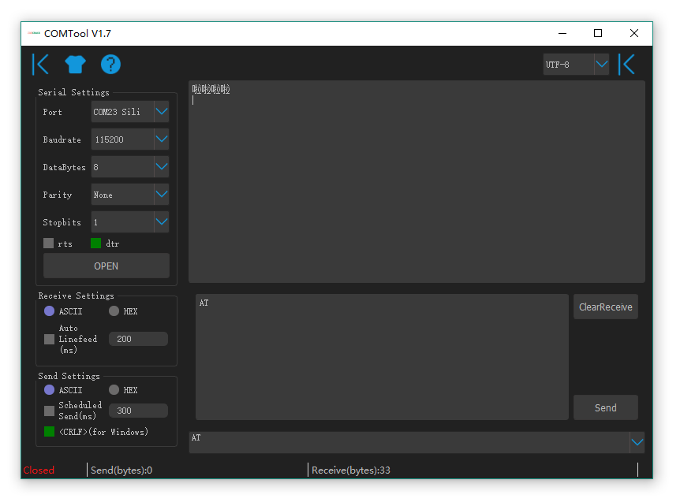
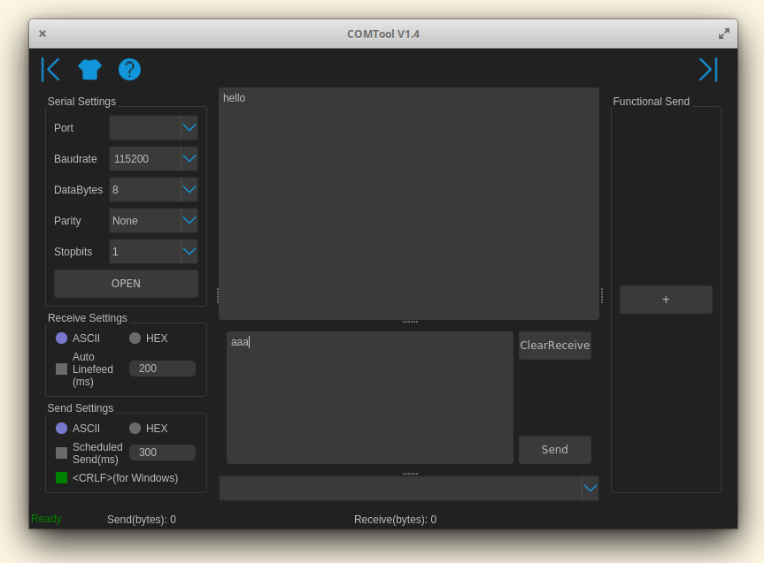
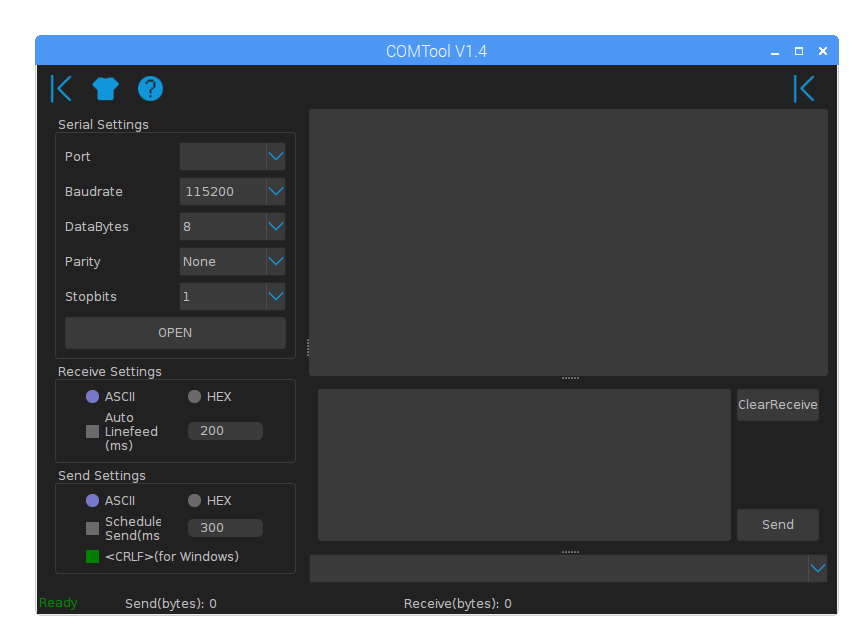

COMTool
========

 [](https://pypi.python.org/pypi/comtool/)
 
[](https://travis-ci.org/Neutree/COMTool)

A cross platform serial debug tools written by python
--------

Windows

Linux(Elementry OS)

Raspberry Pi3

> screenshot shows the version 1.0, the latest may not the same totally! But better performance、more easy to use and more elegant

## Features

- [x] cross platform (Windows, Linux, MacOS, Raspberry Pi ... ...)
- [x] port baudrate bytesize parity stopbits settings
- [x] basic send data (ascii and hex)
- [x] basic receive data (ascii and hex)
- [x] send and receive data count
- [x] clear received data area
- [x] auto linefeed on every once receive
- [x] scheduled auto send
- [x] send history and select send again
- [x] serial auto detect
- [x] CR LF / LF select support
- [x] auto save settings
- [x] <kbd>Ctrl+Enter</kbd> to send
- [ ] escape character support, like \x \r \n etc.
- [x] multiple character encode support(ASII,GBK(Chinese),UTF-8,UTF-16......)
- [ ] multiple auto send (order and disorder)
- [ ] unix style terminal color support
- [x] night theme and White theme
- [ ] real time data graphic display
- [x] rts & dtr control by hand

## Install

### Windows

Test pass on Win10

there's three ways:
1. download excutable bin file, easiest way for one never used python
  * Download the latest bin file at the [release page](https://github.com/Neutree/COMTool/releases)
  * unzip, and run comtool.exe
2. Install Python3 first then install from pypi:
  * [dowload python3](https://www.python.org/downloads/)
  * Install by pip,
```
pip install comtool
comtool
```
3. Or you can download source code, then install from source code
  * download sourcecode
  * install
```
python setup.py bdist_wheel
pip install dist/COMTool-*.*.*-py3-none-any.whl
comtool
```
or
```
pip3 install pyinstaller
python pack.py
cd dist
```


### Linux

Test on Ubuntu 16 18 and Elementry OS 4

there's many ways to install comtool on linux

* (1) Download release (Recommend)

Download release at [release](https://github.com/Neutree/COMTool/releases) page


* (2) Download and install from [pypi] by pip

```
sudo apt install python3
sudo apt install python3-pip
sudo pip3 install comtool
sudo comtool
```
> The installation proccess will automatically install PyQt5, it may takes a long times!!!
> you can install pyqt5 manually by command `sudo apt install python3-pyqt5` or `sudo pip3 install pyqt5`


* (3) Or get by tool `get-pip.py`

```
sudo apt install python3
wget https://bootstrap.pypa.io/get-pip.py 
sudo python3 get-pip.py
sudo pip3 install comtool
sudo comtool
```

> be sure python bin path already in the `$PATH` env.

* (4) Just install from github source code by pip

```
sudo apt install python3 python3-pip
sudo pip3 install git+https://github.com/Neutree/COMTool
sudo comtool
```

* (5) Or you can download source code, then install from source code

```
python setup.py bdist_wheel
sudo pip3 install dist/COMTool-*.*.*-py3-none-any.whl
```
or
```
pip3 install pyinstaller
python3 pack.py
cd dist/comtool
./comtool
```

We should add current user to dialout group to avoid `sudo` command
```
sudo usermod -a -G dialout $USER
grep 'dialout' /etc/group
reboot #must reboot to take effect
```


### macOS

* (1) Download release (Recommend)

Download release at [release](https://github.com/Neutree/COMTool/releases) page

* (2) Install from pipy

```
brew install python3 python3-pip
sudo pip3 install COMTool
```
> It will automatically install pyqt5, may takes a lot of time depend on your network

* (3) Install from source

```
pip3 install pyinstaller
python3 pack.py
cd dist
```
then double click `comtool.app`

### Rasberry Pi

Test pass on Raspberry Pi 3
just open terminal, type the command below:
```
sudo apt install git
git clone https://github.com/Neutree/COMTool.git
cd COMTool
python setup.py bdist_wheel
sudo pip3 install dist/COMTool-*.*.*-py3-none-any.whl
comtool
```
then enjoy

## Development

1. Install python3.6 and pip3

Linux:
```
sudo apt install python3 python3-pip
```

Windows: 
  [dowload python3](https://www.python.org/downloads/)

2. install pyserial and PyQt5
```
sudo pip3 install pyserial pyqt5 bs4
```
On Raspberry:
```
sudo pip3 install --upgrade pyserial bs4
sudo apt install python3-pyqt5
```

3. clone project
```
git clone https://github.com/Neutree/COMTool.git
```

4. code, resolve bugs or add new reatures

Recommended `PyCharm` IDE to get start


5. pull request

## Issue and improvement

Create issue [here](https://github.com/Neutree/COMTool/issues/new)


