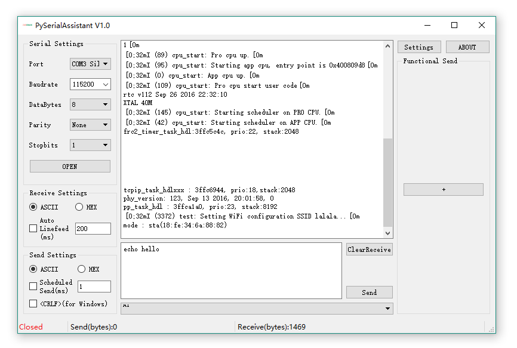

PySerialAssistant
========
A cross platform serial debug tools written by python

> screenshot shows the version 1.0, the latest may not the same totally! But better performance、more easy to use and more elegant

## Features

- [x] cross platform
- [x] port baudrate bytesize parity stopbits settings
- [x] basic send data (ascii and hex)
- [x] basic receive data (ascii and hex)
- [x] send and receive data count
- [x] clear received data area
- [x] auto linefeed on every once receive
- [x] scheduled auto send
- [x] send history and select send again
- [x] serial auto detect
- [x] CR LF / LF select support
- [x] auto save settings
- [x] <kbd>Ctrl+Enter</kbd> to send
- [ ] escape character support, like \x \r \n etc.
- [ ] multiple character encode support
- [ ] multiple auto send (order and disorder)
- [ ] night theme and White theme

## Install

### Windows

* Download the latest bin file at the [release page](https://github.com/Neutree/PyserialAssistant/releases)

* unzip, and run PyserialAssistant.exe

### Linux

* download and install
for Ubuntu, use ppa:
```

```
or download bin file at the [release page](https://github.com/Neutree/PyserialAssistant/releases)

for others, refer to [Development](Development)

* run PySerialAssistant

### Mac
Not test yet

## Development

1. Install python3.6 and pip
```
```

2. install pyserial and PyQt5
```
```

3. clone project
```
```

4. code, resolve bugs or add new reatures
```
```

5. pull request
```
```

