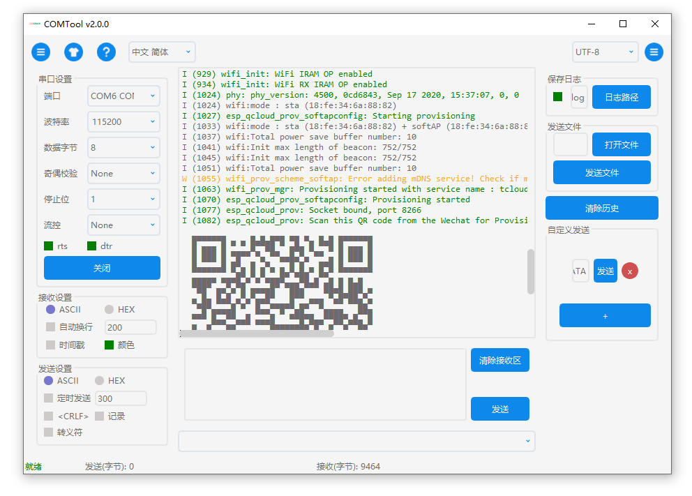
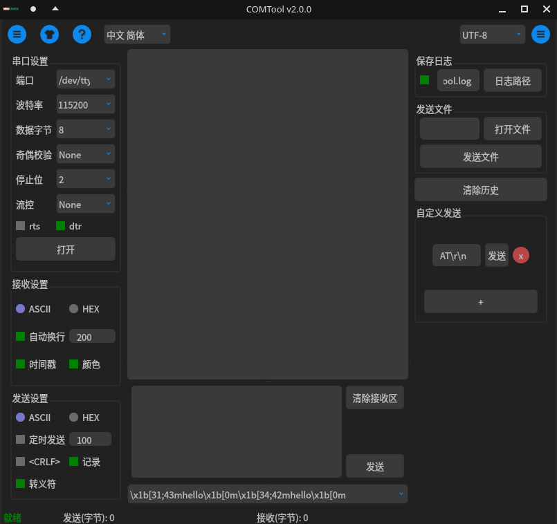
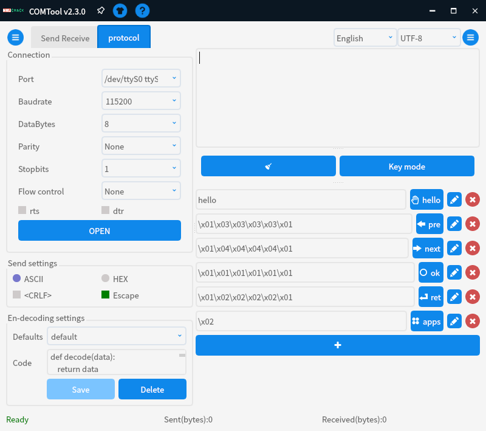
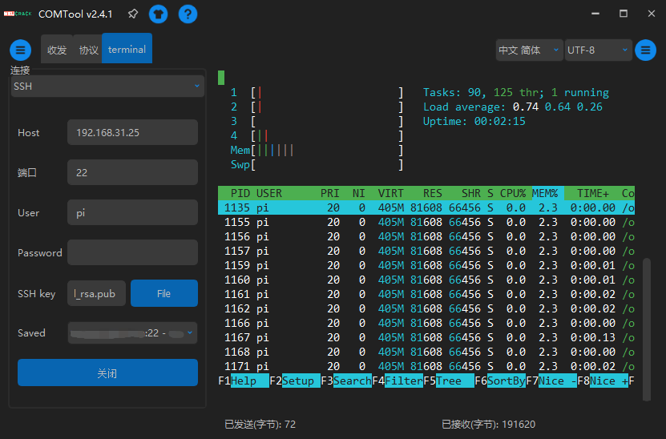

COMTool
========

[English](./README.MD) | 中文

  [](https://pypi.python.org/pypi/comtool/)   

 [](https://github.com/Neutree/COMTool/releases) [](https://pypi.org/project/COMTool/) [](https://sourceforge.net/projects/comtool)


跨平台开源串口调试助手，使用 python 编写

--------

| Windows | Linux | Raspberry Pi | macOS |
| ------- | ----- | ------------ | ----- |
|  |  | 
 | |


| 白色主题 | 黑色主题 | 协议插件 | TCP/UDP | 终端 |
| ------ | ------- | ------- | ------- | ------ |
|  |  |  |  |  |


> 截图可能不是最新的版本， 最新的版本只会更好用更好看

## 特性

- [x] 跨平台 (Windows, Linux, macOS, Raspberry Pi)(使用 python 编写，只要你的平台支持 python)
- [x] 可靠，界面不会卡死
- [x] 多语言支持
- [x] 串口自动检测，支持记住上次使用的串口号
- [x] 串口断线自动重连
- [x] 波特率（随意设置）、校验、停止位、流控等设置支持
- [x] 基础收发功能(字符(ASCII) 和 十六进制(HEX))
- [x] 收发计数
- [x] 清空接收缓冲区支持
- [x] 自动换行
- [x] 定时发送
- [x] 发送记录保存和再次选中发送
- [x] 自定义常用发送内容，一键发送
- [x] 两种常用换行符CR LF(\r\n) 和 LF(\n) 支持
- [x] 自动保存设置（退出保存）
- [x] 快捷键比如 <kbd>Ctrl+Enter</kbd> 发送数据
- [x] 转义字符支持，比如 `\r \n \t \x` 等
- [x] 多种字符编码格式支持，比如 `ASII,GBK(Chinese),UTF-8,UTF-16` 等
- [x] 收发记录，以及添加时间戳和记录到文件功能
- [x] 发送文件
- [x] `unix` 终端风格颜色支持，比如`\x1b[33;42mhello\x1b[0mhello2`
- [x] 白色主题和黑色主题切换
- [x] `rts` 和 `dtr` 手动控制
- [x] 自定义协议编解码支持
- [x] 自定义快捷键发送（在协议功能里面）
- [x] TCP UDP 支持
- [x] 终端模式支持
- [x] 插件支持（插件开发请看[docs/plugins_zh.md](./docs/plugins_zh.md)）
- [ ] 实时图像数据显示


## 安装可执行程序（无需安装，直接执行）

### Windows

* 在 [release](https://github.com/Neutree/COMTool/releases) 或 [sourceforge](https://sourceforge.net/projects/comtool/files/) 下载最新的可执行文件
* 解压`.zip`文件，点击`comtool.exe`运行
> 另外你也可以使用 scoop 安装, 由 [StudentWeis](https://github.com/Neutree/COMTool/issues/50) 维护
> ```
> scoop bucket add Nightly https://github.com/StudentWeis/Nightly
> scoop install comtool
> ```

### Linux


Linux版本太多，我们只为ubuntu编译二进制。
其他发行版请[从 pypi 或源码安装](#以-python-包形式安装)。
如果你有什么好的跨平台打包想法，比如 flatpak 或 appimage，你可以贡献一个 PR 或添加一个 issue 来告诉我如何可以做到

> Arch Linux 及其衍生版本可以通过 AUR 仓库在线安装：(目前由 [taotieren](https://github.com/Neutree/COMTool/issues/44) 维护)：
> ```bash
> # 发行版
> yay -S python-comtool
> # 开发版
> yay -S python-comtool-git
> ```

* 在 [release](https://github.com/Neutree/COMTool/releases) 页面或 [sourceforge](https://sourceforge.net/projects/comtool/files/) 下载最新版本
* 如果不想使用`sudo`命令自动软件，则需要将当前用户添加到`dialout`组
```shell
sudo usermod -a -G dialout $USER
grep 'dialout' /etc/group
reboot #must reboot to take effect
```

* 解压`.zip`文件，双击`comtool`运行

### 树莓派


只需打开终端，输入以下命令：
```
sudo apt install git
git clone https://github.com/Neutree/COMTool.git --depth=1
cd COMTool
pip3 install .
# 或者
# python setup.py bdist_wheel
# sudo pip3 install dist/COMTool-*.*.*-py3-none-any.whl
```

* 如果不想使用`sudo`命令自动软件，则需要将当前用户添加到`dialout`组
```shell
sudo usermod -a -G dialout $USER
grep 'dialout' /etc/group
reboot #must reboot to take effect
```

然后通过命令启动
```
comtool
```

### macOS

* 在 [release](https://github.com/Neutree/COMTool/releases) 页面或 [sourceforge](https://sourceforge.net/projects/comtool/files/) 下载最新版本
* 安装 dmg 包

如果你想同时打开多个`comtool`，只需要右键 dock 栏图标，选择`新建窗口`即可。

另外也可以打开终端并输入
```
open -n /Application/comtool.app
```
或者
```
cd /Applicatioin/comtool.app/Contents/MacOS
./comtool
```

> 因为程序没有开发者签名，所以第一次打开时会警告，需要到`设置 -> 安全和隐私 -> 通用` 看到提示`comtool` 点击 `仍要打开`即可


## Windows Defender 显示 comtool 可执行程序是恶意软件？

如果你的软件是从[这里](https://github.com/Neutree/COMTool/releases)下载的，没关系，这是[打包产生的问题](https://github.com/pyinstaller/pyinstaller/issues/4852)，所有的源码和打包脚本都在这里，连打包过程都是用`github action`完全自动化，没有人手动打包。

如果你仍然担心，只需下载源代码，然后使用 `python`运行或自己打包。

当然，如果你找到更好的打包方式，请来 `issue` 告诉我们。


## 以 python 包形式安装

对于开发者，或者没有你的平台的预编译软件， 可以使用这种方式安装

* 先安装 `Python3`
  * 如果是 `windows` 或 `macOS`：[下载 python3](https://www.python.org/downloads/)
  * 如果 `linux`: 比如`ubuntu`， `sudo apt install python3 python3-pip`, macOS `brew install python3 python3-pip`

* 确保你有`pip`
```shell
pip3 --version
# 或者
pip --version
```

如果没有这个命令，安装
```shell
python3 -m ensurepip
```

* 然后从 `pypi` 安装：
```shell
pip3 install comtool
comtool
```

在国内，为了下载速度更快， 你可以用 `tuna` 镜像更快地下载：
```shell
pip install -i https://pypi.tuna.tsinghua.edu.cn/simple comtool
```

* 也可以直接从 `github` 安装
```
pip3 install git+https://github.com/Neutree/COMTool
```

* 或者你也可以下载源码，然后从源码安装
  * 下载源码，[在网页下载](https://github.com/Neutree/COMTool) 或 `git clone https://github.com/Neutree/COMTool.git`
  * 安装
```
cd COMTool
pip install .
```
或者自己构建 `wheel` 可执行文件
```
pip3 install wheel
python setup.py bdist_wheel
pip install dist/COMTool-*.*.*-py3-none-any.whl
comtool
```

* 如果不想使用`sudo`命令自动软件，则需要将当前用户添加到`dialout`组
```shell
sudo usermod -a -G dialout $USER
grep 'dialout' /etc/group
reboot #must reboot to take effect
```

## Linux 手动添加程序图标到开始菜单

* 复制 [tool/comtool.desktop](tool/comtool.desktop) 文件到`/usr/share/applications`目录（可能需要 `root` 权限）
* 修改`/usr/share/applications/comtool.desktop`，替换里面的图标路径 `Icon=/usr/local/COMTool/assets/logo.ico` 为实际的[图标](COMTool/assets/logo.ico)路径或者你喜欢的图标，保存即可
* 在开始菜单里面就可以找到 comtool 应用了

## 打包成可执行文件


```shell
pip3 install pyinstaller
python pack.py
cd dist
ls
```


## 开发

1. 安装 `python(>=3.8)`和`pip3`

Linux：
```
sudo apt install python3 python3-pip
```

Windows: 
  [下载 python3](https://www.python.org/downloads/)

2. 安装`pyserial`和`PyQt5`等包（在[requirements.txt](requirements.txt)中列出）
```
cd COMTool
pip3 install -r requirements.txt
```

在树莓派上，可以通过 `apt` 命令安装 `python3-pyqt5`：
```
sudo pip3 install --upgrade pyserial
sudo apt install python3-pyqt5
```

3. 克隆项目
```
git clone https://github.com/Neutree/COMTool.git
```

4. 撸码、解决错误或添加新的特性

推荐使用 `PyCharm` IDE 或 `vscode` 开始

运行方法：
需要先生成翻译所需要的二进制文件(`.mo`)

```
python COMTool/i18n.py finish
```

然后执行主程序即可

```
python COMTool/Main.py
```

5. 创建合并请求

## 添加翻译

* 先安装环境（`requirments.txt`中的`python pip`包）
```shell
apt install python3 python3-pip
pip3 install -r requirements.txt
```

* 如果你需要添加新语言，否则跳过此步骤

在 [i18n.py](./COMTool/i18n.py) 中添加语言
```
locales=["en", "zh_CN", "zh_TW", "ja"]
```
将你的语言附加到此列表中，可以在 [此处](https://www.science.co.il/language/Locale-codes.php) 或 [wikipedia](https://en.wikipedia.org/wiki/Language_localisation)，例如`zh_CN`表示中国大陆，对应的语言是简体汉字，`zh_TW`表示中国台湾，语言是繁体字，你也可以只用`zh`来使用中文简体字

* 生成翻译文件

```shell
python i18n.py prepare
```

此命令将在 `locales` 文件夹中生成 `.po` 文件

* 手动翻译

然后翻译`.po`文件，这是一个叫`gettext`的标准翻译文件格式，可以直接手动改文件，也可以利用网上的工具

* 生成二进制翻译文件

为了让程序读得更快，文本文件`.po`应该转换成二进制文件`.mo`，运行命令：
```shell
python i18n.py finish
```
然后你可以看到`locales/<locale>/LC_MESSAGES/messages.mo`文件

* 测试

运行应用程序，你会看到新的翻译

* 合并请求

创建 PR 以将你的更改合并到 [comtool 仓库](https://github.com/Neutree/COMTool)


## 问题和意见

创建 [issue](https://github.com/Neutree/COMTool/issues/new)


## 开源协议

[LGPL-3.0 许可证](LICENSE)

以库的方式使用了以下开源项目:

* [PyQt5](https://www.riverbankcomputing.com/software/pyqt/): [GNU GPL v3](https://www.riverbankcomputing.com/software/pyqt/)
* [pyserial](https://github.com/pyserial/pyserial): [BSD-3-Clause](https://github.com/pyserial/pyserial/blob/master/LICENSE.txt)
* [requests](https://github.com/psf/requests): [Apache 2.0](https://github.com/psf/requests/blob/main/LICENSE)
* [Babel](https://github.com/python-babel/babel): [BSD](https://github.com/python-babel/babel/blob/master/LICENSE)
* [qtawesome](https://github.com/spyder-ide/qtawesome): [MIT](https://github.com/spyder-ide/qtawesome/blob/master/LICENSE.txt)
* [pyte](https://github.com/selectel/pyte): [LGPL 3.0](https://github.com/selectel/pyte/blob/master/LICENSE)
* [paramiko](https://github.com/paramiko/paramiko): [LGPL 2.1](https://github.com/paramiko/paramiko/blob/main/LICENSE)
* [pyperclip](https://github.com/asweigart/pyperclip): [BSD-3-Clause](https://github.com/asweigart/pyperclip/blob/master/LICENSE.txt)

